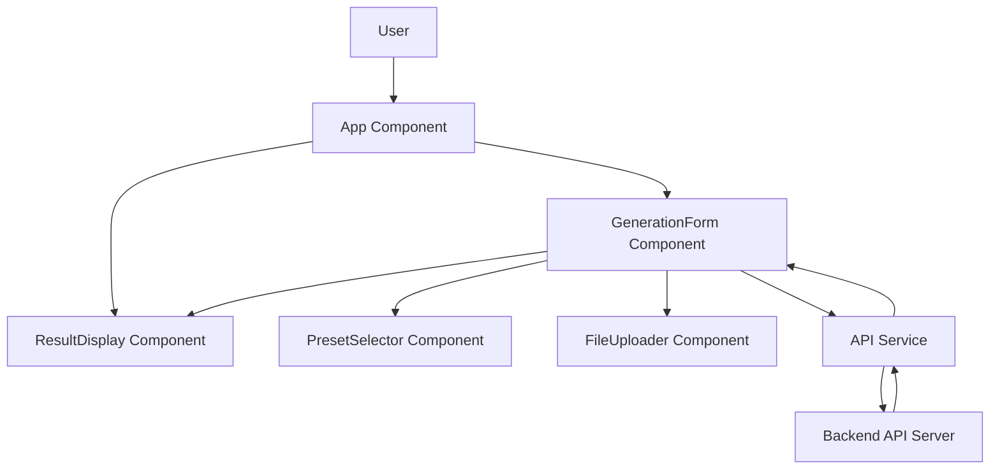

# Design Document

## Overview

The React Image Generation UI is a single-page application that provides an intuitive interface for generating styled product images. The application follows a component-based architecture using React functional components with hooks for state management. It communicates with a backend API server to trigger the AI-powered image generation workflow and displays results in real-time.

The design emphasizes simplicity, clear user feedback, and a smooth user experience with proper loading states and error handling.

## Architecture

### High-Level Architecture



### Component Hierarchy

```
App
├── GenerationForm
│   ├── PresetSelector
│   └── FileUploader
└── ResultDisplay
```

### Technology Stack

- **React**: 18.x (functional components with hooks)
- **axios**: HTTP client for API communication
- **CSS Modules** or **styled-components**: Component styling
- **Vite** or **Create React App**: Build tooling

## Components and Interfaces

### App Component

**Purpose**: Root component that orchestrates the application layout and manages shared state between GenerationForm and ResultDisplay.

**State**:

- `finalImageURL: string | null` - URL or data URI of the generated image
- `errorMessage: string | null` - Error message to display

**Props**: None (root component)

**Responsibilities**:

- Render GenerationForm and ResultDisplay components
- Pass state setters to GenerationForm for updating results
- Pass display data to ResultDisplay

### GenerationForm Component

**Purpose**: Main form component that collects user inputs and triggers image generation.

**State**:

- `userPrompt: string` - User's text description
- `selectedPreset: string` - Selected preset filename (e.g., "preset_bright_clean.json")
- `referenceImage: string | null` - Base64-encoded reference image
- `isLoading: boolean` - Loading state indicator
- `validationErrors: object` - Form validation errors

**Props**:

- `onSuccess: (imageURL: string) => void` - Callback when generation succeeds
- `onError: (errorMessage: string) => void` - Callback when generation fails

**Methods**:

- `handlePromptChange(event)` - Updates userPrompt state
- `handlePresetChange(preset)` - Updates selectedPreset state
- `handleImageUpload(base64String)` - Updates referenceImage state
- `validateForm()` - Validates required fields before submission
- `handleSubmit()` - Submits generation request to API

**UI Elements**:

- Text input/textarea for user prompt with character counter
- PresetSelector component
- FileUploader component
- Generate button (disabled during loading)
- Loading spinner (visible when isLoading is true)

### PresetSelector Component

**Purpose**: Allows users to select from available style presets.

**State**:

- `selectedPreset: string` - Currently selected preset

**Props**:

- `presets: Array<{value: string, label: string}>` - Available presets
- `selectedPreset: string` - Currently selected preset
- `onChange: (preset: string) => void` - Callback when selection changes
- `disabled: boolean` - Whether the selector is disabled

**Implementation Options**:

1. Button group with visual cards showing preset names
2. Dropdown/select menu for compact display
3. Radio buttons with labels

**Preset Mapping**:

```javascript
const PRESETS = [
  { value: 'preset_bright_clean.json', label: 'Bright Clean' },
  { value: 'preset_luxury_reflection.json', label: 'Luxury Reflection' },
  { value: 'preset_minimalist_shadow.json', label: 'Minimalist Shadow' },
  { value: 'preset_natural_warm.json', label: 'Natural Warm' },
  { value: 'preset_vibrant_pop.json', label: 'Vibrant Pop' },
  // Additional presets...
];
```

### FileUploader Component

**Purpose**: Handles reference image file selection and conversion to base64.

**State**:

- `fileName: string | null` - Name of uploaded file
- `previewURL: string | null` - Preview URL for uploaded image

**Props**:

- `onImageUpload: (base64String: string) => void` - Callback with base64 string
- `disabled: boolean` - Whether the uploader is disabled

**Methods**:

- `handleFileSelect(event)` - Processes file selection
- `convertToBase64(file)` - Converts File object to base64 string
- `validateFileType(file)` - Ensures file is an accepted image format

**UI Elements**:

- File input (accept="image/png,image/jpeg,image/jpg")
- Preview thumbnail or filename display
- Clear/remove button

**Base64 Conversion Logic**:

```javascript
const convertToBase64 = (file) => {
  return new Promise((resolve, reject) => {
    const reader = new FileReader();
    reader.onload = () => resolve(reader.result);
    reader.onerror = (error) => reject(error);
    reader.readAsDataURL(file);
  });
};
```

### ResultDisplay Component

**Purpose**: Displays the generated image or error messages.

**Props**:

- `imageURL: string | null` - URL or data URI of generated image
- `errorMessage: string | null` - Error message to display
- `isLoading: boolean` - Whether generation is in progress

**UI States**:

1. **Idle**: No content displayed (initial state)
2. **Loading**: Loading spinner with message
3. **Success**: Generated image with download option
4. **Error**: Error message with retry suggestion

**UI Elements**:

- Image element for displaying generated image
- Download button (when image is available)
- Error message container
- Loading spinner

### API Service

**Purpose**: Encapsulates all HTTP communication with the backend API.

**File**: `src/services/api.js`

**Methods**:

- `generateImage(payload)` - Sends generation request to backend

**Configuration**:

```javascript
const API_BASE_URL = 'http://localhost:5000';
const API_TIMEOUT = 120000; // 2 minutes for long-running generation

const apiClient = axios.create({
  baseURL: API_BASE_URL,
  timeout: API_TIMEOUT,
  headers: {
    'Content-Type': 'application/json',
  },
});
```

**Request Payload Structure**:

```javascript
{
  user_prompt: string,
  preset_name: string,
  reference_image?: string // Optional base64 string
}
```

**Response Structure (Success)**:

```javascript
{
  success: true,
  final_image_url: string,
  master_prompt: string // Optional
}
```

**Response Structure (Error)**:

```javascript
{
  success: false,
  error: string
}
```

**Error Handling**:

- Network errors: "Unable to connect to the server. Please check your connection."
- Timeout errors: "Request timed out. Please try again."
- API errors: Extract error message from response
- Unknown errors: "An unexpected error occurred. Please try again."

## Data Models

### FormData

```typescript
interface FormData {
  userPrompt: string;
  selectedPreset: string;
  referenceImage: string | null;
}
```

### Preset

```typescript
interface Preset {
  value: string;      // Filename (e.g., "preset_bright_clean.json")
  label: string;      // Display name (e.g., "Bright Clean")
}
```

### GenerationRequest

```typescript
interface GenerationRequest {
  user_prompt: string;
  preset_name: string;
  reference_image?: string;
}
```

### GenerationResponse

```typescript
interface GenerationResponse {
  success: boolean;
  final_image_url?: string;
  master_prompt?: string;
  error?: string;
}
```

## Error Handling

### Form Validation

**Client-Side Validation**:

- User prompt: Required, minimum 3 characters
- Preset selection: Required
- Reference image: Optional, must be valid image format if provided

**Validation Timing**:

- On form submission (before API call)
- Real-time feedback for character count

**Error Display**:

- Inline error messages below each field
- Prevent submission if validation fails

### API Error Handling

**Error Categories**:

1. **Network Errors** (axios network error):
   - Display: "Unable to connect to the server. Please check your connection."
   - Action: Allow retry

2. **Timeout Errors** (axios timeout):
   - Display: "Request timed out. The generation process is taking longer than expected. Please try again."
   - Action: Allow retry

3. **API Errors** (4xx, 5xx responses):
   - Display: Error message from response body
   - Action: Allow retry with corrected inputs

4. **Unknown Errors**:
   - Display: "An unexpected error occurred. Please try again."
   - Action: Allow retry

**Error Recovery**:

- Clear error messages when user modifies inputs
- Provide clear retry mechanism (re-enable form)
- Log errors to console for debugging

## Testing Strategy

### Unit Tests

**Components to Test**:

1. **PresetSelector**:
   - Renders all preset options
   - Calls onChange when selection changes
   - Displays selected preset correctly
   - Respects disabled state

2. **FileUploader**:
   - Accepts valid image files
   - Rejects invalid file types
   - Converts files to base64 correctly
   - Displays preview/filename
   - Handles file removal

3. **ResultDisplay**:
   - Displays loading state correctly
   - Renders image when provided
   - Displays error messages
   - Shows download button with valid image

4. **API Service**:
   - Constructs correct request payload
   - Handles successful responses
   - Handles error responses
   - Handles network errors

### Integration Tests

**Scenarios to Test**:

1. **Complete Generation Flow**:
   - User enters prompt
   - User selects preset
   - User clicks generate
   - Loading state displays
   - Success response displays image

2. **Error Handling Flow**:
   - API returns error
   - Error message displays
   - User can retry

3. **Reference Image Flow**:
   - User uploads image
   - Image converts to base64
   - Request includes reference image
   - Generation succeeds

### Manual Testing Checklist

- [ ] Form validation prevents submission with missing required fields
- [ ] Loading spinner displays during API call
- [ ] Form inputs are disabled during loading
- [ ] Generated image displays correctly
- [ ] Download button works
- [ ] Error messages display for various error types
- [ ] Reference image upload and preview work
- [ ] Preset selection updates correctly
- [ ] Character counter updates in real-time
- [ ] Application works with and without reference image

## UI/UX Considerations

### Layout

**Desktop Layout**:

- Two-column layout: Form on left, results on right
- Fixed form width, flexible result area
- Responsive breakpoints for tablet and mobile

**Mobile Layout**:

- Single column, stacked layout
- Form at top, results below
- Sticky generate button

### Visual Feedback

**Loading States**:

- Spinner with "Generating your image..." message
- Disabled form inputs with reduced opacity
- Progress indication if possible

**Success States**:

- Smooth fade-in animation for generated image
- Success message or checkmark
- Prominent download button

**Error States**:

- Red/warning color scheme
- Clear error icon
- Actionable error message

### Accessibility

- Proper ARIA labels for all form inputs
- Keyboard navigation support
- Focus management during loading states
- Alt text for generated images
- Screen reader announcements for state changes

## Design Decisions and Rationales

### State Management

**Decision**: Use React hooks (useState) for local component state, lift shared state to App component.

**Rationale**:

- Application is relatively simple and doesn't require Redux or Context API
- Lifting state to App allows ResultDisplay to access generation results
- Keeps components focused and testable

### API Communication

**Decision**: Use axios instead of fetch API.

**Rationale**:

- Better error handling out of the box
- Automatic JSON transformation
- Request/response interceptors for future enhancements
- Timeout configuration support
- Requirement 8 specifies axios

### Base64 Encoding

**Decision**: Convert reference images to base64 in the frontend.

**Rationale**:

- Simplifies API payload structure (JSON only)
- Avoids multipart/form-data complexity
- Consistent with backend expectations
- Easier to debug and test

### Preset Display

**Decision**: Map preset filenames to user-friendly labels.

**Rationale**:

- Improves user experience (no technical filenames)
- Maintains compatibility with backend (sends actual filename)
- Easy to extend with preset descriptions or thumbnails

### Component Separation

**Decision**: Create separate PresetSelector and FileUploader components.

**Rationale**:

- Single Responsibility Principle
- Easier to test in isolation
- Reusable in other contexts
- Cleaner GenerationForm component

### Error Message Strategy

**Decision**: Display errors in ResultDisplay component, not inline in form.

**Rationale**:

- Centralizes user attention on results area
- Distinguishes between validation errors (inline) and API errors (results)
- Consistent location for all generation outcomes
